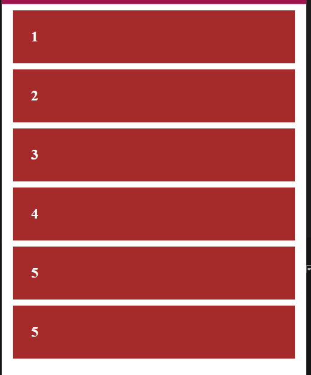

# CSS FlexBox

# **সিএসএস ফ্লেক্সবক্স শিখুন, অসাধারণ সব লে-আউট বানান**

CSS Flexbox  হচ্ছে  responsive Web Design   এর জন্য একটি গুরুত্বপুর্ন  মডিউল। যার উদ্দেশ্য হচ্ছে একটা কন্টেইনারে থাকা আইটেমগুলোর মধ্যে স্পেস, অ্যালাইনমেন্ট , লেআউট প্রতিস্থাপনসহ আরো কিছু ব্যাপার রেস্পন্সিভ অয়েতে  সঠিক জায়গায় ইমপ্লিমেন্ট করা । ফ্লেক্সবক্সের সাহায্যে সাইজ জানা নেই অথবা ডায়নামিক সাইজের ইলিমেন্টও হ্যান্ডেল করা যায় খুব সহজেই।

আমরা সাধারনত যখন কোন website layout তৈরী করি তখন CSS এর float এবং position property ব্যবহার করে থাকি।  বর্তমানে CSS flexbox এর মাধ্যমে আতি সহজেই আমরা website layout তৈরী করতে পারি। এর মাধ্যমে আমরা যে কোন layout এর items গুলোকে rows এবং columns অনুষারে  vertically এবং horizontally align করতে পারি আবার কোন layout কে সহজেই responsive ও করতে পারি।

### চলুন এইবার কিছু CSS Flexbox  এর কিছু প্রপার্টি এবং ভ্যালু গুলো দেখে আসি।

### Container Flexbox properties and Value

কন্টেইনারের মাঝে আমরা যেই ফ্লেক্সবক্স এর প্রপারটি গুলো ব্যবহার করতে পারি 

- Flexbox Implement  করার জন্য আমাদের কন্টেইনারের মাঝে  যেটি ইউস করতে হবে তা হল
    
    ```css
    display: flex; //  like block element behavour
    display:inline-flex; // like inline element behavour
    ```
    
- পুর্বের কোডে আমরা ডিক্লিয়ার করলাম যে তুমি ফ্লেক্সিবল হয়ে যাও। ফ্লেক্সিবল হলে লাভ কি?  তুমি ফ্লেক্সিবল হয়ে যাও তার মানে হচ্ছে যে  ফ্লেক্স করা  ইলিমেন্টে তার যততুকু জায়গা প্রয়োজন ততটুকু নিবে তার বেশি নিবে না।
- এখন আমাদের বলতে হবে এটি কোন বরাবর ফ্লেক্সিবল হবে । row বরাবর নাকি কলাম বরাবর।
    - row বরাবর হবে নাকি কলাম বরাবর হবে এর জন্য যেই প্রপারটি তা হল  ```flex-dirextion ```

```css

flex-direction: row; // row বরাবর ফ্লেক্সিবল
flex-direction: column; // column বরাবর ফ্লেক্সিবল

flex-direction: row-reversed; // row বরাবর উল্টো করে ফ্লেক্সিবল
flex-direction: column; // column  বরাবর উল্টো করে ফ্লেক্সিবল
```

এবার কিছু এইচটিএমএল সিএস এস এর মাধমে দেখা যাক

```html
<!DOCTYPE html>
<html>
<head>
    <title>Learn CSS Flex Box</title>
</head>
<style>
.container{
    /* display: flex; */
}
.box{
    padding: 30px;
    background-color: brown;
    color: white;
    font-weight: 700;
    font-size: 24px;
    margin: 10px;
}
</style>

<body>
    <div class="container">
        <div class="box">1</div>
        <div class="box">2</div>
        <div class="box">3</div>
        <div class="box">4</div>
        <div class="box">5</div>
        <div class="box">5</div>
    </div>
</body>

</html>
```

এটি হচ্ছে সিম্পল এইচটিএমেল যার আউটপুট টা হচ্ছে অনেকটা এমন ;



এখন container class  এর মাঝে ফ্লেক্স করে দেখি আউটপুটঃ

```css
.container{
display:flex;
flex-direction:column;
}

/*
ফ্লেক্সবক্সে ডিরেক্সশন কিছু মেনশন না করলে flex-direction:row; হিসেবে  ধরে নেয়।
*/
```


এখন যদি রো  করতে চাই তাহলেঃ

```css
.container{
    display: flex;
    flex-direction: row;
}
```


এখন যদি রো বরাবর রিভার্স করতে চাই তাহলেঃ

```css
.container{
    display: flex;
    flex-direction: row-reverse;
}
```

এখানে একটি বিষয় লক্ষনীয়ঃ রো বরাবর রিভার্স হয়ে গেছে।


অনুরুপভাবে কলাম রিভার্স করে চাইলেঃ

```css
.container{
    display: flex;
    flex-direction: column-reverse;
}
```


এইখানে একটা সমস্যা সৃষ্টি করে তা হচ্ছেঃ

আইটেম এর পরিমান বেশি হয়ে গেলে তা রো বরাবর যায়গা নেয়। এবং এটি ব্রেক করে না যেটা রেস্পন্সিভে ইসু  করে । 


এইখানে একটা স্ক্রলবারের উপস্থিতি দেখা যাচ্ছে। যেই সমস্যা টা সমাধান করার জন্য  আমরা ব্যবহার করতে পারি  যা সম্পুর্ন  রো এর জায়গা পূর্ণ হয়ে গেলে নিচের রো তে জায়গা করে নেয়।

> flex-wrap: wrap
> 

```
.container{
    display: flex;
    flex-wrap: wrap;
}
```


এইখানে দেখা যায় যে কন্টেন্ট গুলা স্ক্রিন অনসারে নিচে জায়গা করে নিয়েছে কলাম বরাবর।

### এলাইন পজিশন ঠিক করার জন্য  কিছু প্রপারটিঃ

- কলাম বরাবর কিছু করতে চাইলেঃ align-items নামের property এর মাধ্যমে আমরা items গুলোকে **cross-axis** বরাবর align করতে পারব। align items এর কিছু value হল – **flex-start | flex-end | center | baseline | stretch**
- row বরাবর কিছু করতে চাইলেঃ align-items নামের property এর মাধ্যমে আমরা items গুলোকে **cross-axis** বরাবর align করতে পারব।justify-content এর কিছু value হল – **flex-start | flex-end | center | space-between | space-around**

```css
.container {
  display: flex;
  width: 100vh;
  align-items: center;
  justigy-content: center;
}
```

তাহলে আউটপুট হবেঃ


বাকিগুলো ট্রাই করে দেখতে পারেন। 

এইখানে আমি একটা বেসিক ধারণা দেয়ার ট্রাই করলাম।  flexbox  এর হাত ঝালিয়ে নিতে চাইলে এই লিঙ্কটি এক্সপ্লোর করতে পারেন।

[Flexbox Froggy](https://flexboxfroggy.com/)